# Radarr - Movie Library Manager

Radarr is a movie collection manager for Usenet and BitTorrent users. It can monitor multiple RSS feeds for new movies and will interface with clients and indexers to grab, sort, and rename them. It can also be configured to automatically upgrade the quality of existing files in the library when a better quality format becomes available.

!!! Info "Additional Application Information - External Links"
    - Local WebUI Address: &nbsp; &nbsp;[http://localhost:7878](http://localhost:7878)
    - Application Website: &nbsp; &nbsp; &nbsp;[https://wiki.servarr.com/en/radarr](https://wiki.servarr.com/en/radarr)
    - Docker Information: &nbsp; &nbsp; &nbsp; [https://docs.linuxserver.io/images/docker-radarr](https://docs.linuxserver.io/images/docker-radarr)

## Check Secure VPN Connection

If your are using the fully secure media stack configuration and routing all outbound network traffic via the Gluetun VPN container, you can check whether the secure VPN tunnel has been established with the following Docker commands:

!!! Note "Checking if Docker Container is Connected / Hidden behind Secure VPN"

    === "Linux Shell"

        ``` bash
        sudo docker exec -it radarr bash
        ```

    === "Windows PowerShell"

        ``` powershell
        docker exec -it radarr bash 
        ```

    === "MacOS Shell"

        ``` bash
        docker exec -it radarr bash
        ```

    === "Synology NAS (SSH)"

        ``` bash
        sudo docker exec -it radarr bash
        ```

    === "Portainer GUI"

        From the Portainer WebUI, find the container you wish to connect to, then select the `>_ Console` link.

    Once you have successfully connected to the Docker container, run the following command on the console, to check the IP Address which it is using through the VPN tunnel.

    ``` bash
    curl ifconfig.io
    ```

    The IP Address in the Docker container should be different to your home IP Address, check this at [https://ifconfig.io](https://ifconfig.io).

> If the Docker container is configured to connect to the Internet through the Gluetun VPN container and there is no active VPN connection, then no network traffic will be passed out to the Internet. The Gluetun VPN connection is a safeguard for secure network transfers and activates a "hard block" when there is no VPN connection established.

!!! Warning

    You can disregard the above security check if you are not routing this Docker traffic through the Gluetun VPN container.

## Configuration Prerequisites

Before following this guide, you should have already completed:

- Configured and integrated the Prowlarr Index Search Manager: &nbsp; &nbsp; &nbsp; [Prowlarr Configuration Guide](prowlarr.md)
- Synchronised the Prowlarr Indexers to each ARR Application: &nbsp; &nbsp; &nbsp; [Connect ARR Apps to Prowlarr](prowlarr.md#connect-arr-apps-to-prowlarr)
- Configured and integrated qBittorrent Torrent download client: &nbsp; &nbsp; &nbsp; [Add qBittorent to *ARR Apps](qbittorrent.md#add-qbittorent-to-arr-apps)
- Configured and integrated SABnzbd Usenet download client: &nbsp; &nbsp; &nbsp; [Add SABnzbd to *ARR Apps](sabnzbd.md#add-sabnzbd-to-arr-apps)


!!! Warning "Warning: This guide assumes you have followed the above pre-requisite configurations"

    This guide assumes you have already configured the above components using the associated guides listed above, and that Radarr is already integrated into Prowlarr, and connected to both Torrent and Usenet download clients.


## Change Date and Languages

To change the date and language in the WebUI Portal, select ==Settings== --> ==UI==


<figure markdown>
  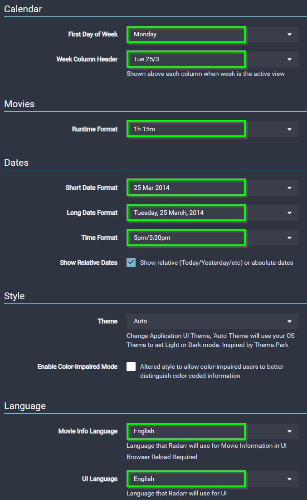{ width="300" }
  <figcaption>Radarr WebUI Date and Language Settings</figcaption>
</figure>


## Certification Country Metadata

To change the Certification Country for metadata information and ratings in the WebUI Portal, select ==Settings== --> ==Metadata== and select the appropriate country in the ==Certification Country== drop down menu, and save settings.


<figure markdown>
  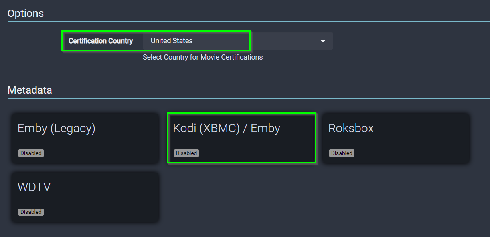{ width="300" }
  <figcaption>Radarr Certification Country for Metadata</figcaption>
</figure>


<figure markdown>
  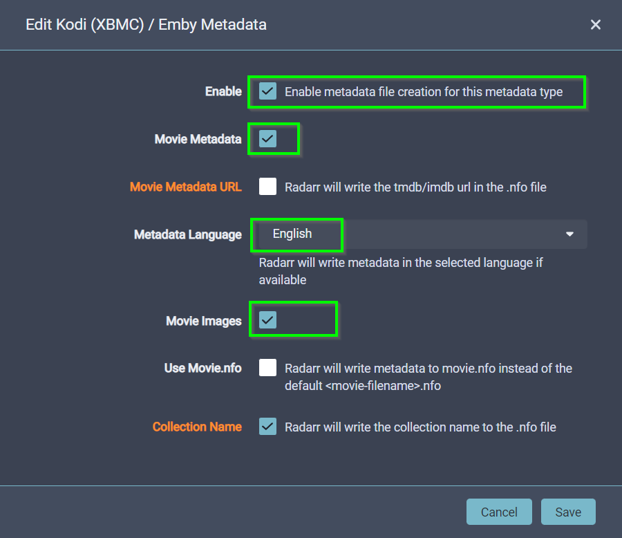{ width="300" }
  <figcaption>Radarr Metadata Settings</figcaption>
</figure>


## Set File Naming Standards

Radarr is a Library Manager for movie media files, and managed the files inside the `/data/media/movies` directory, where the Jellyfin media player will read them, so we need to make sure we use the folder and file naming structure which Jellyfin needs, so the movies can be easily imported into Jellyfin when it scans the folder for new / deleted content.


!!! Note "Note: Radarr Should Manage All Files / Naming For The Media Player"

    The ARR Media Library Managers should be used for all the adding, renaming, deleting of all media from each of your libraries and the managed filesystem. This gives you greater control over the media you choose to download / import into each of the media managers, while Jellyfin simply undertakes a scan of the filesystem on a regular basis to see if the media manager has made any changes... like added new media, or imported a better quality of existing media.

    Your Jellyfin media player, or any other media player you choose to use (Plex / Emby / Kodi etc..), should be set to read-only access to the media library directory, this prevents your media player from deleting media files being managed by the ARR managers.

    Addtionally, many users give their family members / friends an account on their media server, who in-turn accidently delete media from inside the media player after they've watched the media. Blocking your media player from deleting files will save your media from accidently / unintentional deletion.

To set up naming standards, browse to ==Settings== --> ==Media Management== and make following settings:

| Format Name            | Format Setting (Jellyfin Standard) |
|------------------------|------------------------------------|
| Colon Replacement:     | ==Replace with Dash== | 
| Standard Movie Format: | `{Movie CleanTitle} {(Release Year)} {imdbid-{ImdbId}} - {edition-{Edition Tags}} {[Custom Formats]}{[Quality Full]}{[MediaInfo 3D]}{[MediaInfo VideoDynamicRangeType]}{[Mediainfo AudioCodec}{ Mediainfo AudioChannels}]{MediaInfo AudioLanguages}[{Mediainfo VideoCodec}]{-Release Group}` | 
| Movie Folder Format:   | `{Movie CleanTitle} {(Release Year)} - [imdbid-{ImdbId}]` | 

<figure markdown>
  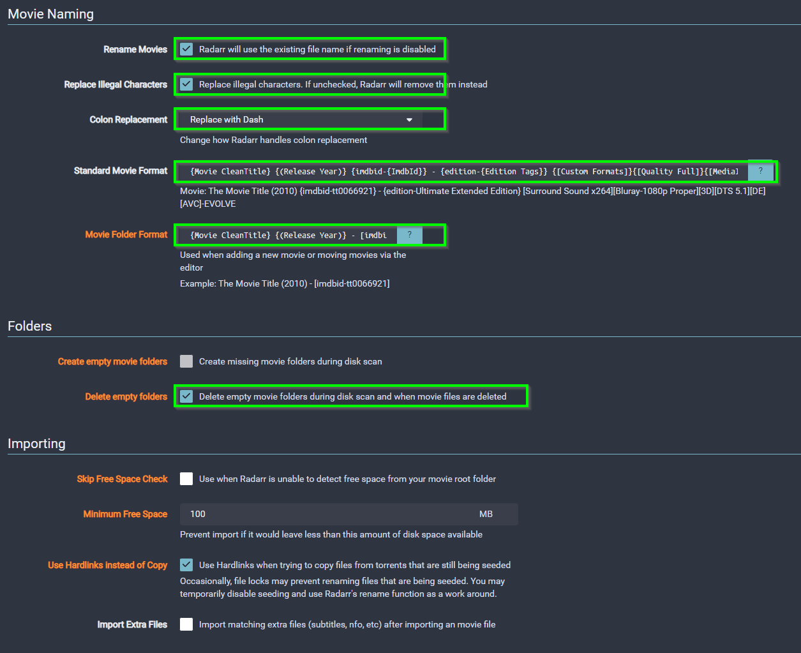{ width="300" }
  <figcaption>Radarr Movie Naming Settings</figcaption>
</figure>

!!! Note "Naming Standards for Different Media Players"

    The naming formats listed above will work fine for Jellyfin and many other media players, however you may need to consult the file-format requirements of your alternate media player if the above do not work correctly.

    Jellyfin Naming Standards: [https://jellyfin.org/docs/general/server/media/movies/](https://jellyfin.org/docs/general/server/media/movies/)

    Alternate Radarr Naming Guidance: [https://wiki.servarr.com/radarr/settings#media-management](https://wiki.servarr.com/radarr/settings#media-management)


To adjust Radarr file management settings, browse to ==Settings== --> ==Media Management== and scroll down to ==File Management== and make any necessary changes.

> Note: The defaults below should be acceptible, unless you need to make custom changes based on your storage / retention requirements.


<figure markdown>
  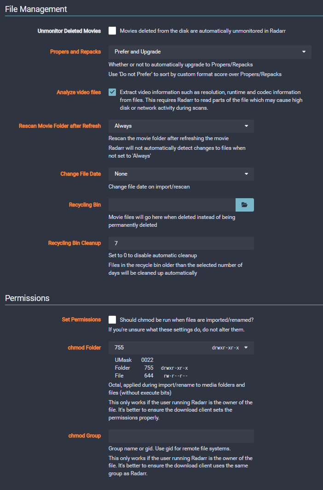{ width="300" }
  <figcaption>Radarr Movie File Management</figcaption>
</figure>


## Set Media Storage Folder

Radarr has now been configured so it can start importing / downloading any media using the correct file naming formats for Jellyfin (or your alternate media player).

To link your media library and being importing movies, select ==Radarr== --> ==Movies== --> ==Import Existing Movies==

<figure markdown>
  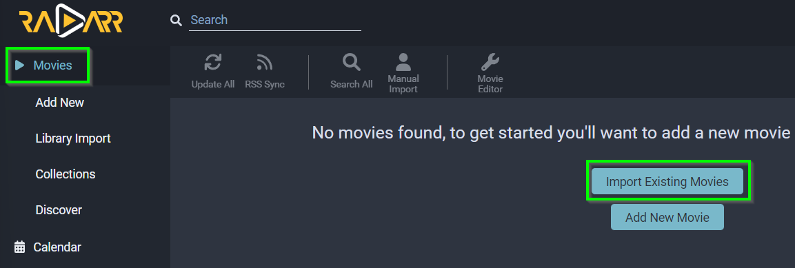{ width="300" }
  <figcaption>Radarr Import Media Library</figcaption>
</figure>

As this is the first time running the import wizard, you need to tell Radarr where your media is located, select ==Start Import== then navigate to the `/data/media/movies` directory and press ==

<figure markdown>
  { width="300" }
  <figcaption>Radarr Start Import Prompt</figcaption>
</figure>

<figure markdown>
  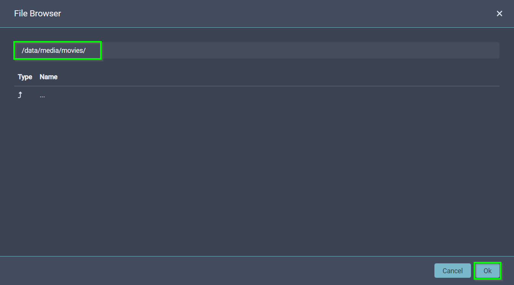{ width="300" }
  <figcaption>Radarr Select Media Library Folder</figcaption>
</figure>

If you have successfully mapped the root media folder to `/data/media/movies` and you don't yet have any folders or media in this directory, then you will see the following display, and there will be no value in the "Unmapped Folders" column.

<figure markdown>
  { width="300" }
  <figcaption>Radarr Mapped Media Library Folder</figcaption>
</figure>

!!! Note "Adding and Removing Root Media Folders"

    You can also map media folders by going to ==Radarr== --> ==Settings== --> ==Media Management== then scroll to the bottom of the page and click on ==Add Root Folder==.

    The root media folder for Radarr should be set to: `/data/media/movies`

## Importing Media Files

You have now mapped your media folder correctly, however you will need to import any ==Unmapped Folders== so Radarr can manage them in the media manager.

!!! Warning "Import Test Movies"

    If you don't have any movies to import in your library yet, you can create the following folders in your ==movies== folder on your Docker host computer to help test the import process:

    - "Big Buck Bunny (2008) - [imdbid-tt1254207]"
    - "Jaws (1975) - [imdbid-tt0073195]"
    - "Spaceballs (1987) - [imdbid-tt0094012]"

    <figure markdown>
      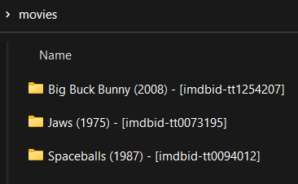{ width="300" }
      <figcaption>Radarr Test Import Folders</figcaption>
    </figure>


When you navigate ==Movies== --> ==Library Import==, you will now see there are ==Unmapped Folders== listed against the `/data/media/movies` folder. Click the folder to import the unmapped movie folders.


<figure markdown>
  { width="300" }
  <figcaption>Radarr Import Unmapped Folder</figcaption>
</figure>

Radarr will 

<figure markdown>
  { width="300" }
  <figcaption>Radarr Import Unmapped Folders</figcaption>
</figure>


<figure markdown>
  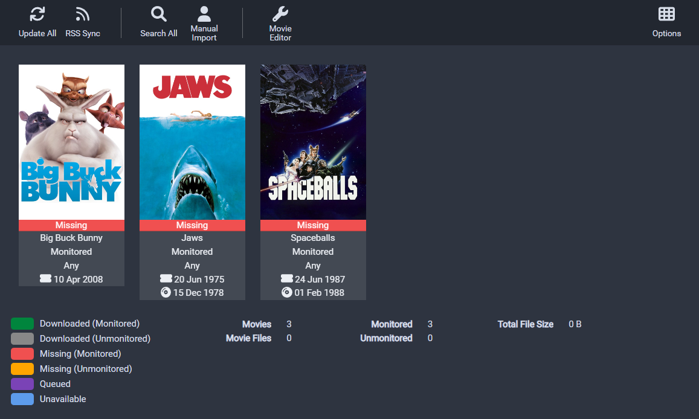{ width="300" }
  <figcaption>Radarr Imported Mapped Media</figcaption>
</figure>


In the main library view, select ==Options== to adjust the view to your liking.

<figure markdown>
  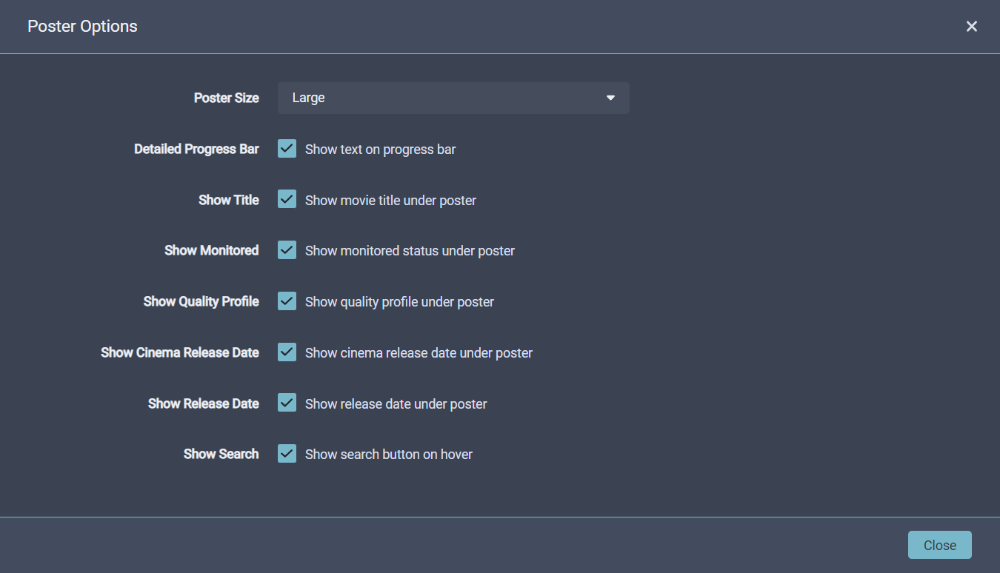{ width="300" }
  <figcaption>Radarr Adjust Display Options</figcaption>
</figure>


## Download Missing Media Files


<figure markdown>
  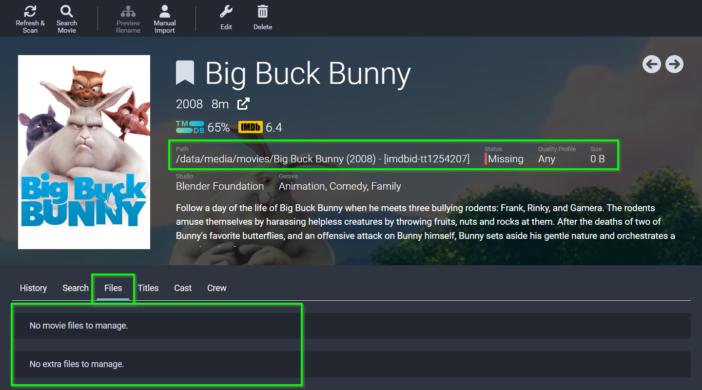{ width="300" }
  <figcaption>Radarr View Media Details</figcaption>
</figure>


<figure markdown>
  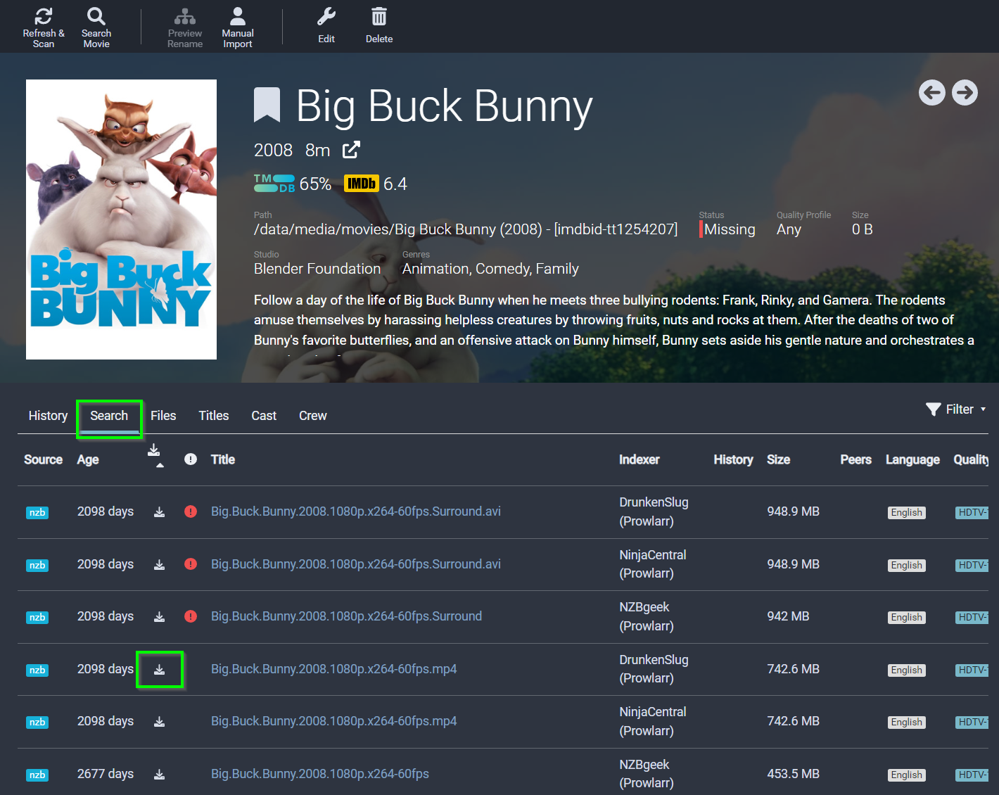{ width="300" }
  <figcaption>Radarr Download Searched Media</figcaption>
</figure>


<figure markdown>
  { width="300" }
  <figcaption>Radarr Downloading Searched Media</figcaption>
</figure>


<figure markdown>
  { width="300" }
  <figcaption>Radarr Downloaded Searched Media</figcaption>
</figure>

<figure markdown>
  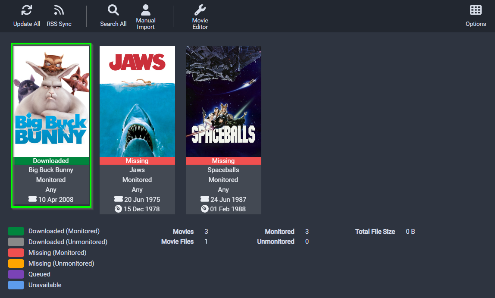{ width="300" }
  <figcaption>Radarr Updated Media Library</figcaption>
</figure>


## Search For Missing Media


<figure markdown>
  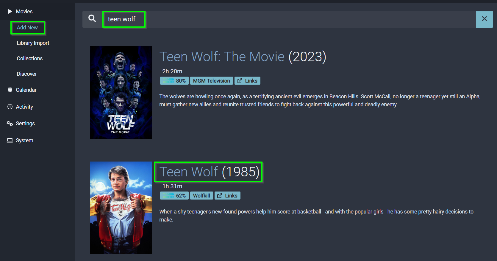{ width="300" }
  <figcaption>Radarr Search for Missing Media Files</figcaption>
</figure>


<figure markdown>
  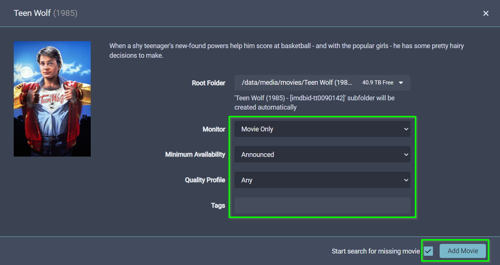{ width="300" }
  <figcaption>Radarr Select Media From Search Results</figcaption>
</figure>


## Set Download Media Profiles


## Set Download Media Quality


## Extra Configuration Settings


## <<< CURRENTLY EDITING UP TO HERE >>>


!!! Success

    Add some information about ratios and seeding days


## Additional Configuration Items

### Change Date and Languages

### Miscellaneous Points

