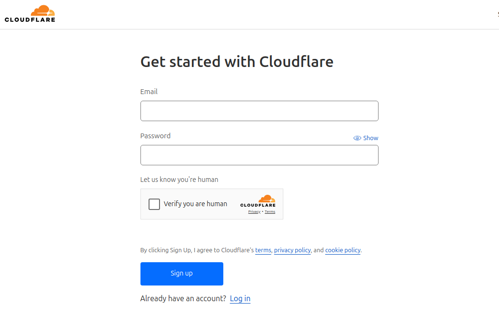
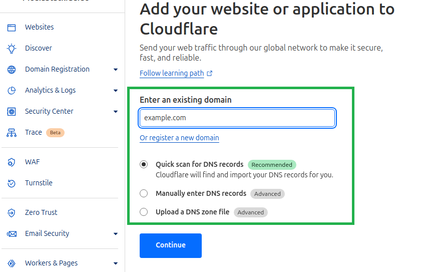
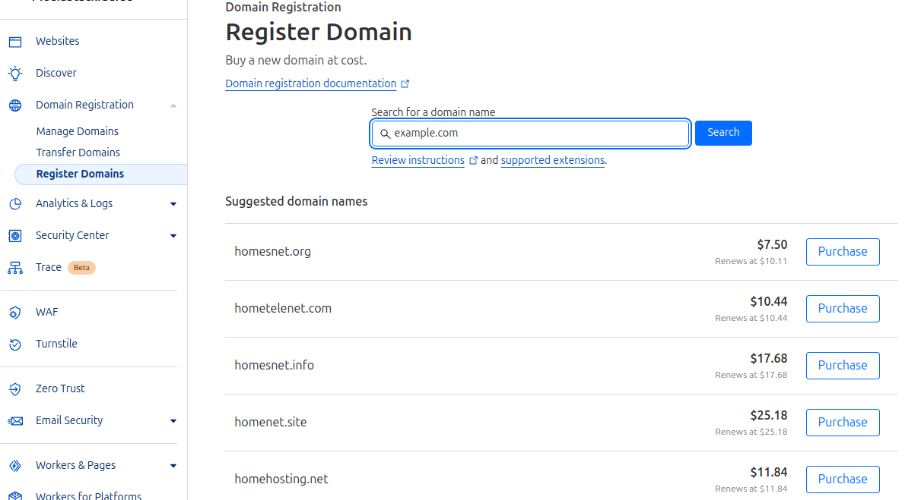
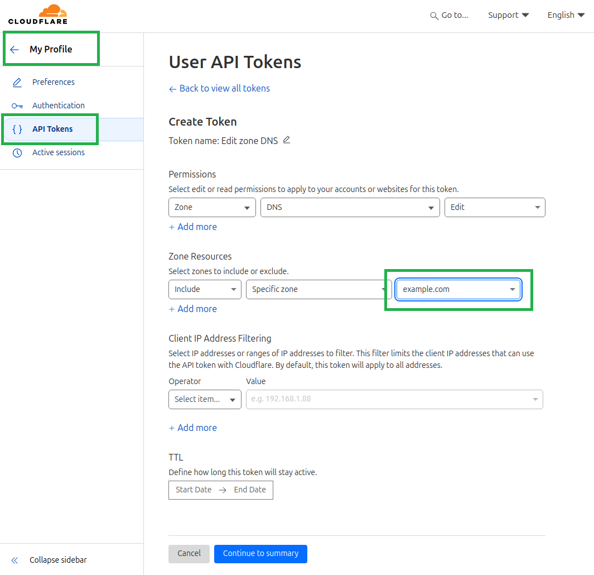
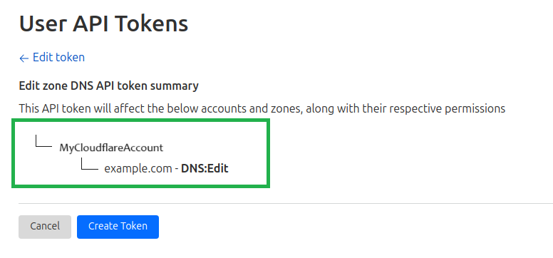
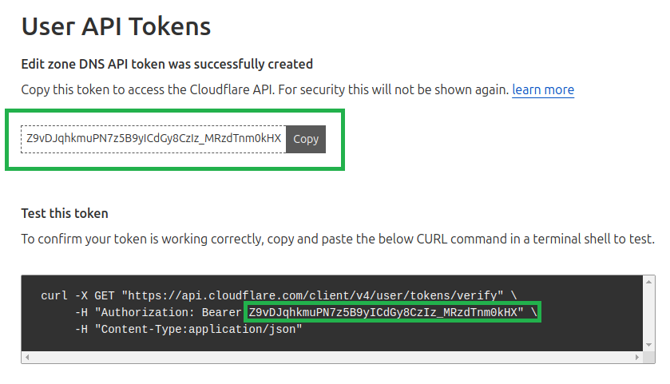
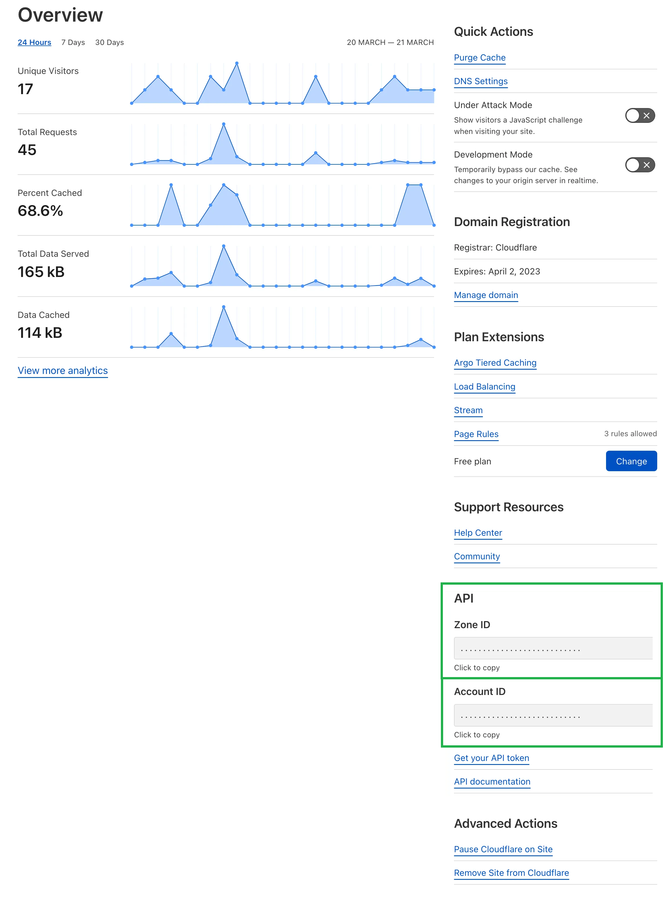
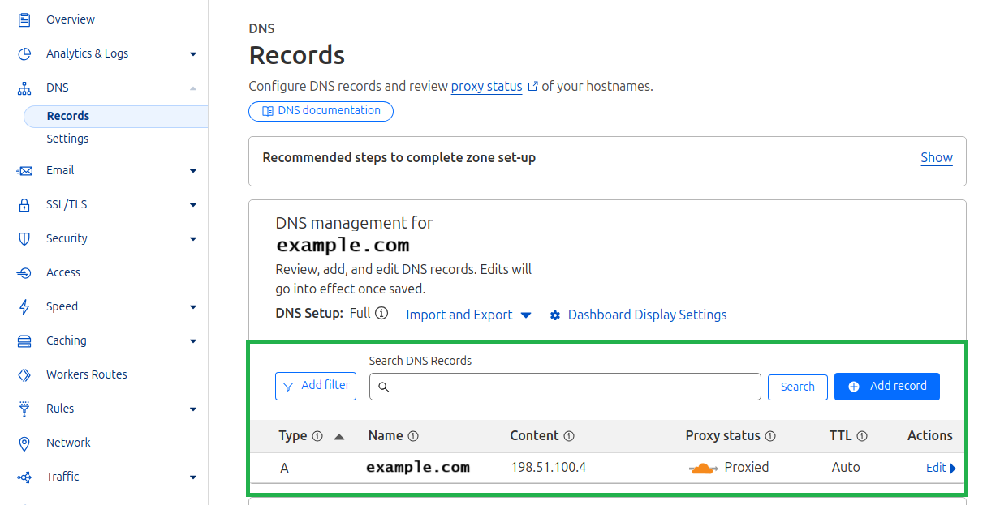
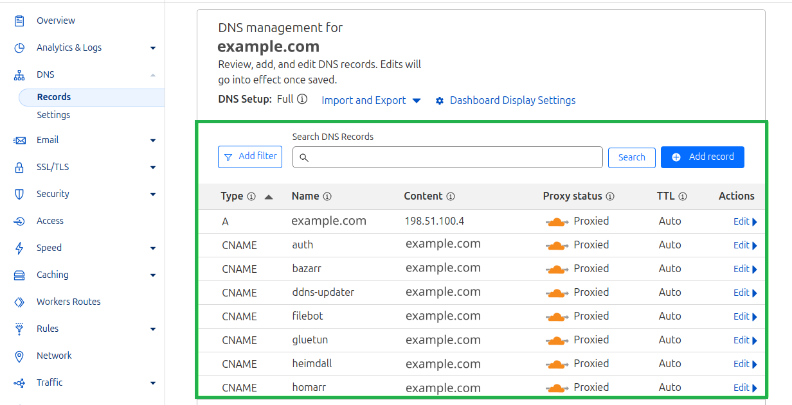
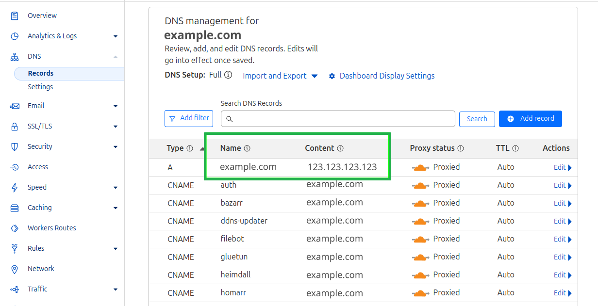

# DNS Resolution  

## Introduction  

Internet-based DNS (Domain Name Service) resolution is a fundamental process that translates human-friendly domain names into machine-readable IP addresses. This process is essential because while humans find it easier to remember domain names, computers and other networked devices rely on IP addresses to communicate. When you enter a URL into your web browser, a DNS query is initiated to find the corresponding IP address. This query travels through various DNS servers until the IP address is returned to your browser, allowing it to connect to the desired web server; in the case of the MediaStack Project, we want to remotely connect to our home network and Docker applications.  

Most home-based Internet connections use dynamically assigned IP addresses, which can change periodically, causing an issue where your domain name (example.com) points to an IP address, which may be assigned to another user from your ISP. To resolve this, we need to ensure our DNS entries are updated, any time your home IP Address changes, to ensure your domain name always points to your home IP address, even when it changes.  

When registering a domain name, you can choose a friendly name that suits you from an Internet DNS Registrar, or you can use a DDNS Provider that generally offers a free subdomain, which is assigned from their own domain name.  

i.e. If you wanted to register example, you could choose a TLD, as example.com, or a DDNS provider would be example.ddnsprovider.org.  

 - DNS:   Small annual fee, however you have full management of the domain and all subdomains, can be routed through Cloudflare  
 - DDNS:  Generally free, however you have very limited management of sub-domains, cannot be routed through Cloudflare  

The MediaStack Guide highly recommends people choose their own TLD (Top Level Domain) name, so you have greater flexibility, management and privacy over the secure remote connection to your home MediaStack environment.  

## Cloudflare DNS  

The best configuration for running MediaStack is to use Cloudflare to manage our DNS entries, as it also allows the DDNS-Updater Docker container to update the DNS records on Cloudflare, when your home IP address changes... And, its free for what we need.  

Register your free Cloudflare account: [https://dash.cloudflare.com/sign-up](https://dash.cloudflare.com/sign-up){:target="_blank"}  


<figure markdown>
  { width="300" }
  <figcaption>Cloudflare - Account Signup</figcaption>
</figure>

If you already have your own domain name, then you can add it to Cloudflare to manage the domains and resolution, just be sure to update the "nameserver" records with your DNS Registrar.

Select  under the "Domain Registration" menu.


<figure markdown>
  { width="300" }
  <figcaption>Cloudflare - Add Domain</figcaption>
</figure>

If you don't have an Internet domain name at all, then you can register a domain name through Cloudflare, as they are a certified DNS registrar.

Cloudflare instructions to register a new domain name: [https://developers.cloudflare.com/registrar/get-started/register-domain](https://developers.cloudflare.com/registrar/get-started/register-domain){:target="_blank"}


<figure markdown>
  { width="300" }
  <figcaption>Cloudflare - Register Domain</figcaption>
</figure>

When you register, or add, your domain name into Cloudflare, be sure to select the "Free Plan" option, which is all we need for MediaStack requirements.


<figure markdown>
  { width="300" }
  <figcaption>Cloudflare - Select Free Plan</figcaption>
</figure>


</br>

## Cloudflare API Token

Now that you have added your domain name into the Cloudflare portal, we want to be able to manage your DNS entries remotely, using the secure API.  

1. You can create your API Token by clicking the following link: [https://dash.cloudflare.com/profile/api-tokens](https://dash.cloudflare.com/profile/api-tokens){:target="_blank"}  

2. Under the "User API Tokens" section, click "Create Token", then select "Edit Zone DNS --> Use Template".
   
3. Select your domain name from the drop-down list under "Zone Resources".
   
4. Select "Continue to summary".

<figure markdown>
  { width="300" }
  <figcaption>Cloudflare - Register API Token</figcaption>
</figure>

5. If you're happy with the details on the "Edit zone DNS API token summary" page, then select "Create Token".

<figure markdown>
  { width="300" }
  <figcaption>Cloudflare - API Token Summary</figcaption>
</figure>

6. Your API Token will now be generated and assign with correct permissions, and displayed on screen.

8. Write down and save your API Token in a secure spot, as Cloudflare will not show you the token again - for security reasons.

<figure markdown>
  { width="300" }
  <figcaption>Cloudflare - API Token Issued</figcaption>
</figure>


### Domain Account ID and Zone ID

11. Log in to the Cloudflare dashboard: 
    
12. Select your account and domain.
    
13. The API section contains your Zone ID and Account ID. To copy these values for API commands or other tasks, select Click to copy.


<figure markdown>
  { width="300" }
  <figcaption>Cloudflare - Account and Zone IDs</figcaption>
</figure>


14. You should now have all of the following values from Cloudflare, so you can remotely manage / update your DNS information with MediaStack.

```
 - API_TOKEN=
 - ACCOUNT_ID=
 - ZONE_ID=
 - DOMAIN=
```

!!! tip

    Make sure you save the Cloudflare API Token somewhere safe, as Cloudflare will not display this Token again. If you forget the Token, you will need to regenerate a new one and manually update all of your configurations.  

    If you need additional assistance, you can refer to Cloudflare guides:  
    
    - Cloudflare API Token guide: [https://developers.cloudflare.com/fundamentals/api/get-started/create-token/](https://developers.cloudflare.com/fundamentals/api/get-started/create-token/){:target="_blank"}.  
    - Cloudflare Account and Zone IDs: [https://developers.cloudflare.com/fundamentals/setup/find-account-and-zone-ids/](https://developers.cloudflare.com/fundamentals/setup/find-account-and-zone-ids/){:target="_blank"}.  

</br>

## Create DNS Entries  

Now that you have all of the APIs and IDs to manage your domain in Cloudflare, we're going to use the following script in Linux CLI terminal, to add an IP address to the Domain.  

In the example below, we are setting the `198.51.100.4` IP Address to your domain name, which is a Cloudflare example IP Address, and we will update it a few steps below when using DDNS-Updater.  

Open Linux CLI, update the values for `API_TOKEN`, `ZONE_ID`, and `DOMAIN`, then paste into the Linux terminal, and press "Enter".  

``` bash
export API_TOKEN="YOUR_API_TOKEN"                # Use your Cloudflare values
export ZONE_ID="YOUR_ZONE_ID"                    # Use your Cloudflare values
export DOMAIN="YOUR.DOMAIN.HERE.COM"             # Use your Cloudflare values


curl -X POST "https://api.cloudflare.com/client/v4/zones/$ZONE_ID/dns_records" \
  -H "Authorization: Bearer $API_TOKEN" \
  -H "Content-Type: application/json" \
  --data '{
  "name": "'"$DOMAIN"'",
  "proxied": true,
  "settings": {},
  "tags": [],
  "ttl": 3600,
  "content": "198.51.100.4",
  "type": "A"
}'
```

<figure markdown>
  { width="300" }
  <figcaption>Cloudflare - Adding First Domain Entry</figcaption>
</figure>

Now that we have the first DNS entry in your Cloudflare Domain Management, we will add the rest of the domains as `CNAME` entries - this means they will point to the first entry, and use the same IP address from above.

Open Linux CLI, update the values for `API_TOKEN`, `ZONE_ID`, and `DOMAIN`, then paste into the Linux terminal, and press "Enter".  

``` bash
export API_TOKEN="YOUR_API_TOKEN"                # Use your Cloudflare values
export ZONE_ID="YOUR_ZONE_ID"                    # Use your Cloudflare values
export DOMAIN="YOUR.DOMAIN.HERE.COM"             # Use your Cloudflare values

declare -a subdomains=(
    "auth"
    "bazarr"
    "ddns-updater"
    "filebot"
    "flaresolverr"
    "gluetun"
    "heimdall"
    "homarr"
    "homepage"
    "jellyfin"
    "jellyseerr"
    "lidarr"
    "mylar"
    "plex"
    "portainer"
    "prowlarr"
    "qbittorrent"
    "radarr"
    "readarr"
    "sabnzbd"
    "smtp"
    "sonarr"
    "tdarr"
    "whisparr"
    "www"
)

for subdomain in "${subdomains[@]}"
do
  curl -X POST "https://api.cloudflare.com/client/v4/zones/$ZONE_ID/dns_records" \
  -H "Authorization: Bearer $API_TOKEN" \
  -H "Content-Type: application/json" \
  --data '{
    "type": "CNAME",
    "name": "'"$subdomain"'",
    "content": "'"$DOMAIN"'",
    "ttl": 1,
    "proxied": true
  }'
  echo
  echo "Created CNAME record for $subdomain.$DOMAIN"
  echo
done
```

<figure markdown>
  { width="300" }
  <figcaption>Cloudflare - All Domain CNAME Entries Added</figcaption>
</figure>

All of the subdomain CNAMES needed for your Remote MediaStack have now been added, however they all still point to the Cloudflare example IP Address of `198.51.100.4`, which we want to be able to update with DDNS-Updater, any time our home IP Address changes.

## DDNS-Updater

We will now configure **DDNS-Updater** to update our IP address records in Cloudflare, whenever your IP address changes. This will be done by using the Cloudflare provider settings, as listed on the DDNS-Updater support documentation.

If you wish to use an alternate DDNS Provider with DDNS-Updater, there is a list of supported DDNS Providers at: [https://github.com/qdm12/ddns-updater#configuration](https://github.com/qdm12/ddns-updater#configuration){:target="_blank"}

Go to your `FOLDER_FOR_DATA/ddns-updater` directory, and create a new file called `config.json`, and add the following JSON text, with your updated Cloudflare information:

```
cd $FOLDER_FOR_DATA/ddns-updater
vi config.json
```

``` json
{
    "settings": [
    {
      "provider": "cloudflare",
      "zone_identifier": "YourCloudflareZoneID",
      "domain": "your-domain-name-goes-here.com",
      "ttl": 600,
      "token": "YourCloudflareToken",
      "ip_version": "ipv4",
      "ipv6_suffix": "",
      "proxied": true
    }
  ]
}
```

!!! Note
    Ensure you update the zone_identifier, domain, and token with the values from your own Cloudflare account, which we covered above.  

        "zone_identifier": "6ad4f76c221075a1e0b653c72k2d57cd"        # Use your Cloudflare values  
        "domain": "your-domain-name-goes-here.com"                   # Use your Cloudflare values  
        "token": "1ua0r5BPQ7o1tQzqr1gZlHC9VlaqaSdUAWG56GIi"          # Use your Cloudflare values  

After you have finished editing the DDNS-Updater config.json file, restart the container for the changes to take effect.  

```
sudo docker config stop ddns-updater  
sudo docker config start ddns-updater  
```

Check DDNS-Updater has no errors in the log:  

```
sudo docker logs ddns-updater  
```

The DDNS-Updater web portal should now show you the updated IP addresses:  

 - http://localhost:8310


<figure markdown>
  { width="300" }
  <figcaption>DDNS-Updater - Status of Domain and IP Address</figcaption>
</figure>

 Additionally, when you check the domain in Cloudflare, you will notice the IP Address we added earlier, has now been updated with DDNS-Updater. This will continue to keep the domain name updated, whenever your home IP Address changes.

<figure markdown>
  { width="300" }
  <figcaption>Cloudflare - DDNS Updates IP Address</figcaption>
</figure>


If you need further information, head over to the DDNS-Updater Wiki:  

 - [https://github.com/qdm12/ddns-updater](https://github.com/qdm12/ddns-updater){:target="_blank"}

</br>

## MediaStack Bookmarks

Now that all of the domain (A) and CNAME entries have been added to your Cloudflare domain for all of the MediaStack remote access, then we can add all of the Bookmark links to your web browser, so you can access them quickly.

Download the "External" bookmark file from GitHub to your computer: [Import Bookmarks - MediaStackGuide Applications (External URLs).html](https://github.com/geekau/mediastack/blob/master/Import%20Bookmarks%20-%20MediaStackGuide%20Applications%20(External%20URLs).html){:target="_blank"}.

Open the "Import Bookmarks - MediaStackGuide Applications (External URLs).html" file with a text editor, and replace all "YOURDOMAIN" entries, with the domain you set up in Cloudflare (example.com).

Example:

```
  <DT><A HREF="https://jellyfin.YOURDOMAIN/">Jellyfin | Media Player</A>
```

Would become:

```
  <DT><A HREF="https://jellyfin.example.com/">Jellyfin | Media Player</A>
```

Now that you have changed all entries for "YOURDOMAIN", you can import the bookmark file into your favourite web browser.

!!! Note
    At this stage, we have set up all of the DNS entries for your domain, so they point to your home IP Address, and we've imported the links for our applications.
    However, we still need to set up DUO, Authelia, SWAG, and Port Forwarding before secure remote access is working correctly, so clicking the links at this stage will only show connection errors.
